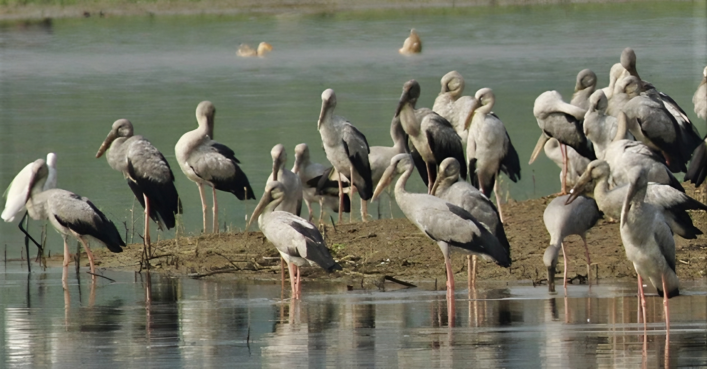
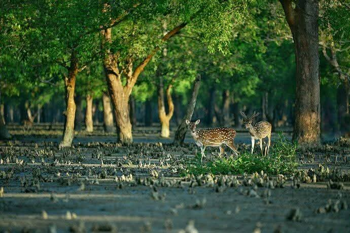
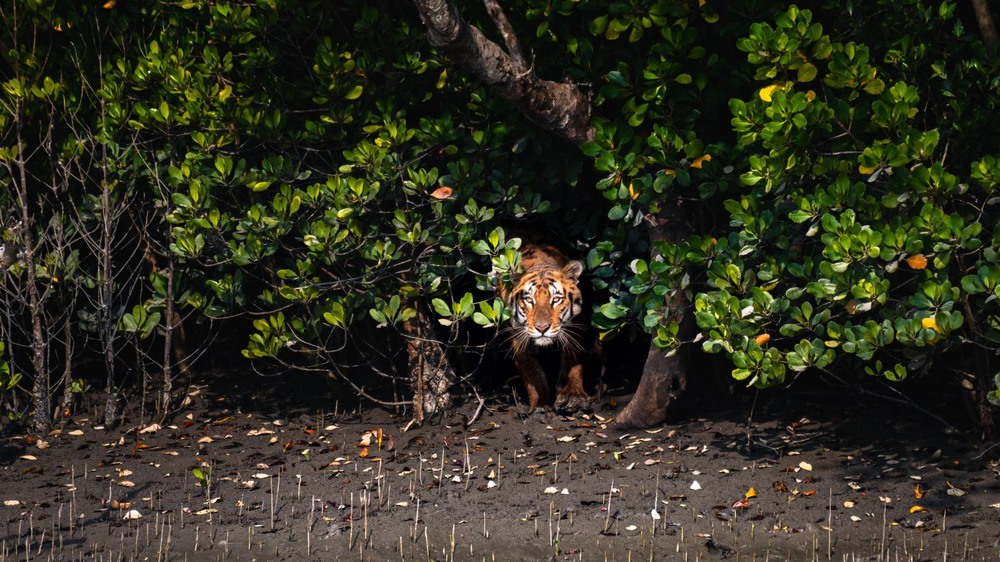
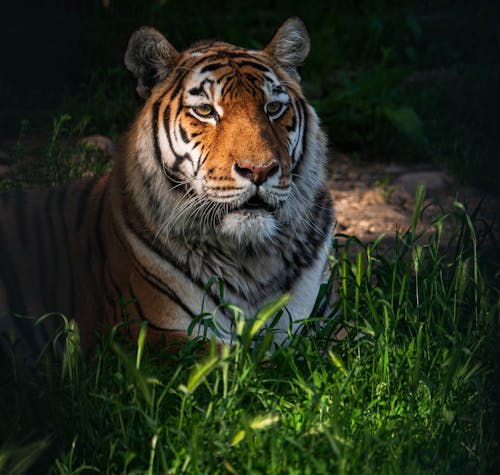

<!DOCTYPE html>
<html lang="en">
<head>
  <meta charset="UTF-8" />
  <meta name="viewport" content="width=device-width, initial-scale=1.0" />
  <title>SIAM HASAN - The Sundarban</title>
  
</head>
<body>
  <header>
    <h1>SIAM HASAN</h1>
    
Roll: 875445

  </header>

  

    <h2>The Sundarban</h2>
    

      
      
      
      
    

    

      

        The Sundarban, often called the emerald crown of Bangladesh, is one of the most enchanting and mysterious places on Earth. Stretching over thousands of square kilometers along the Bay of Bengal, it is the largest mangrove forest in the world — a living masterpiece shaped by the rhythm of tides and time. Its beauty lies not only in its vastness but in its harmony, where the land, water, and sky merge in perfect balance. Countless rivers and creeks twist through emerald greenery, their reflections shimmering under the golden sunlight. The air carries the scent of salt and wildflowers, while the sounds of chirping birds and whispering winds weave together a melody of life.
      

      

        Home to the legendary Royal Bengal Tiger, spotted deer, crocodiles, and exotic birds, the Sundarban is a sanctuary of both serenity and strength. Here, danger and peace coexist — the calm of the forest always holding a hint of wild power. As dawn breaks, mist rises gently over the waterways, and as evening falls, the forest glows in soft amber light, painting a scene that feels almost unreal. For those who visit, the Sundarban offers more than a journey into nature — it is a journey into silence, awe, and connection. It reminds us that true beauty lies in simplicity, balance, and respect for the natural world — a living reminder that even the wildest places on Earth breathe with quiet grace and timeless wonder.
      

    

  

<!-- Google Map Section -->
<!-- Google Map & Image Section -->
<h2>Google Map</h2>

  <!-- বাম পাশে ছবি -->
  

    
    
The Royal Bengal Tiger

    
The most aggressive Animal

    
Sundarban, Bangladesh

  

  <!-- ডান পাশে ম্যাপ -->
  

    <iframe
      src="https://www.google.com/maps/embed?pb=!1m18!1m12!1m3!1d86087.74604733392!2d89.29738063951623!3d21.9484131340132!2m3!1f0!2f0!3f0!3m2!1i1024!2i768!4f13.1!3m3!1m2!1s0x3a01ad003828a725%3A0x8de7bb23cb204815!2sSundarban%20(National%20Mangrove%20forest)%20Bangladesh!5e0!3m2!1sen!2sbd!4v1760852873363!5m2!1sen!2sbd"
      allowfullscreen=""
      loading="lazy"
      referrerpolicy="no-referrer-when-downgrade"
    ></iframe>
  

    

  <footer>
    
© 2025 SIAM HASAN | Inspired by Nature

  </footer>
</body>
</html>
